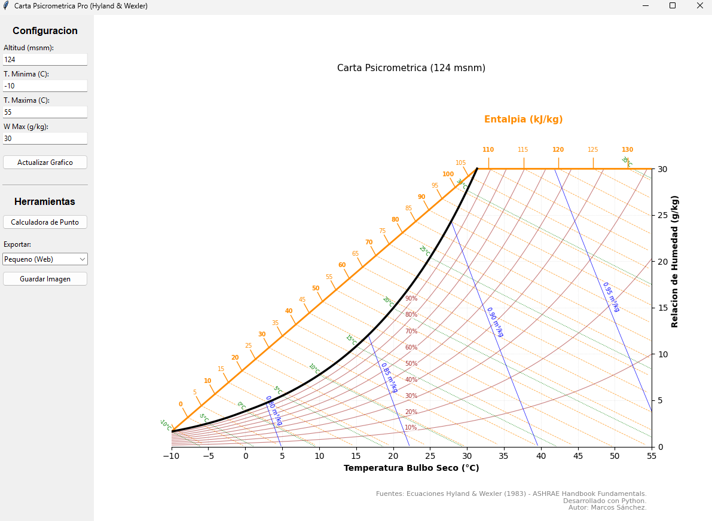

# Carta Psicrométrica Interactiva (ASHRAE) 🌡️💧


Una aplicación de escritorio desarrollada en Python para calcular propiedades termodinámicas del aire húmedo y visualizar procesos en una **Carta Psicrométrica Interactiva**.

Diseñada para estudiantes y profesionales de **Ingeniería Agrícola** y climatización, esta herramienta permite visualizar cambios de estado en tiempo real y realizar cálculos precisos bajo estándares internacionales.


*(Asegúrate de subir tu captura con el nombre screenshot.png)*

## Características Principales

- **Visualización Dinámica:** Generación de gráficos de alta calidad usando `Matplotlib` y `Tkinter`.
- **Cálculos Precisos:** Basado en las formulaciones de **Hyland & Wexler (1983)** del *ASHRAE Handbook Fundamentals*.
- **Configuración Personalizada:**
  - Ajuste de **Altitud (msnm)** para corregir la presión atmosférica.
  - Rangos de temperatura y humedad máxima configurables.
- **Calculadora de Punto:** Módulo para obtener propiedades exactas (Entalpía, Volumen Específico, T. Rocío, etc.) ingresando dos variables conocidas (ej: TBS y HR).
- **Exportación:** Guardado de gráficos en alta resolución (PNG/PDF) para reportes técnicos.

## Tecnologías Utilizadas

* **Python**: Lenguaje principal.
* **Matplotlib**: Renderizado de gráficos e interactividad.
* **NumPy**: Cálculos vectoriales y matemáticos de alto rendimiento.
* **Tkinter**: Construcción de la Interfaz Gráfica de Usuario (GUI).

## Instalación y Uso

Si deseas correr esta herramienta en tu computadora local:

1. **Clonar el repositorio:**
   ```bash
   git clone [https://github.com/masgadicke/carta-psicrometrica-interactiva.git](https://github.com/masgadicke/carta-psicrometrica-interactiva.git)
   ```
2. **Instalar dependencias:** Se requiere Python instalado. Ejecuta:
   ```bash
   pip install -r requirements.txt
   ```
   
3. Ejecutar la aplicación
   ```bash
   python main.py
   ```
   # Fundamento Científico
El software implementa las ecuaciones oficiales de la ASHRAE (American Society of Heating, Refrigerating and Air-Conditioning Engineers) para el cálculo de:

- Presión de saturación (Fórmulas para hielo y agua líquida).

- Razón de humedad y Entalpía.

- Volumen específico del aire húmedo.

# Licencia
Este proyecto está bajo la Licencia MIT - ver el archivo [LICENSE](LICENSE) para más detalles.

Desarrollado por Marcos Sánchez Gädicke Estudiante de Ingeniería Civil Agrícola - Universidad de Concepción
